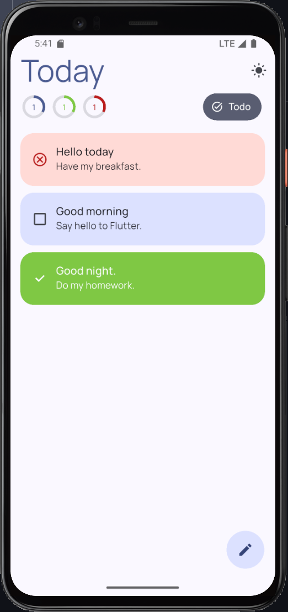
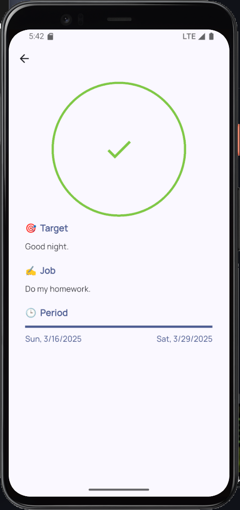
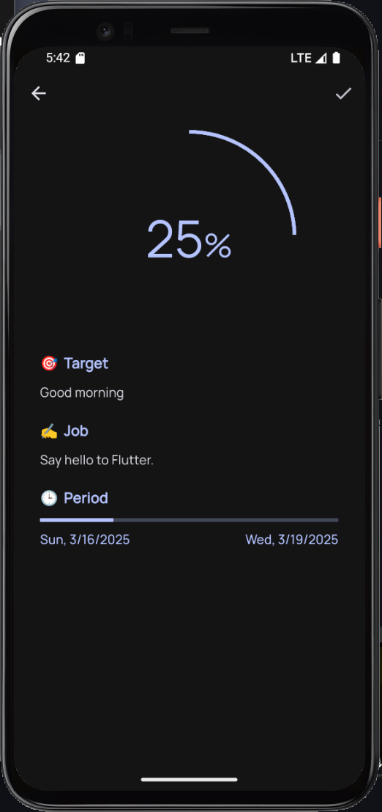

# Today

<div align="center">
  
  <p>A modern Flutter task management application for today's productivity</p>

  [](https://opensource.org/licenses/Apache-2.0)
  [](https://flutter.dev)
  

</div>

## English Version

### 🚀 Introduction

Today is a modern task management application built with Flutter, focusing on best practices and leveraging the most recommended libraries in the Flutter ecosystem. It serves as both a practical productivity tool and a demonstration of clean Flutter architecture.

### 🤔 Why This Application?

When I started learning Flutter, I looked for a convenient library to quickly build applications, which led me to GetX. As the most controversial library in Flutter, it includes route management, dependency injection, state management, and internationalization. This all-in-one library provided great convenience when I was new to Flutter. I could solve many problems by simply programming for GetX without needing to understand many other Flutter features.

However, as my development experience increased, I felt increasingly constrained by GetX. It intruded into too many processes, and whenever I wanted to do more in-depth development or have finer-grained control over a specific part, I had to adapt to GetX's way of doing things. This made me uncomfortable, and I began to dislike the strong dependency of my entire application on a single library. I can heavily depend on a library in one aspect—since each library has its common way of thinking—but not have the entire application follow that library's thinking pattern, which feels restrictive.

Later, I began exploring other excellent libraries. State management libraries like Riverpod, Provider, Bloc, and Mobx showed me new and interesting approaches; go_router made routing powerful and standardized; intl for internationalization and date formatting became popular for good reasons. Today was born in this context, as my exploration of these more Flutter-recommended libraries after moving away from GetX. I wanted to build my code in a more Dart/Flutter-native way, rather than migrating patterns from other languages—I believe Dart/Flutter has its own programming paradigms, like other languages, rather than simply being a migration from JS.

### ✨ Features

Today is not a simple Todo app; from the beginning, I designed it to cover as many potential use cases in an application as possible:

| Category              | Implementation              | Highlights                          |
| --------------------- | --------------------------- | ----------------------------------- |
| **State Management**  | Riverpod + Codegen          | Type-safe providers, Auto-dispose   |
| **Routing**           | go_router                   | Declarative routing, Deep links     |
| **Localization**      | intl                        | Date/time formatting                |
| **Storage**           | Hive                        | Binary serialization, Type adapters |
| **Notifications**     | flutter_local_notifications | Scheduled tasks, Custom channels    |
| **Theming**           | Material Design 3           | Dynamic theme switching             |
| **Project Structure** | Feature-first               | Modular, Maintainable               |

### 🛠️ Tech Stack

- 📱 **State Management**: Riverpod with code generation
- 🧭 **Routing**: go_router
- 💾 **Storage**: Hive
- 🎨 **UI**: Material Design
- 🌐 **HTTP Client**: Dio
- 🔔 **Notifications**: flutter_local_notifications
- 🌍 **Internationalization**: intl
- 🧩 **Others**: freezed, uuid, logger, path_provider, etc.

### 🏁 Getting Started

1. Clone the repository
2. Install dependencies: `flutter pub get`
3. Generate code: `flutter pub run build_runner build --delete-conflicting-outputs`
4. Run the app: `flutter run`

### 📸 Screenshots







### 📄 License

This project is licensed under the [Apache License 2.0](https://www.apache.org/licenses/LICENSE-2.0) - see the LICENSE file for details.

```
Copyright 2024 EricMoin (wu_ming12@foxmail.com)

Licensed under the Apache License, Version 2.0 (the "License");
you may not use this file except in compliance with the License.
You may obtain a copy of the License at

    http://www.apache.org/licenses/LICENSE-2.0

Unless required by applicable law or agreed to in writing, software
distributed under the License is distributed on an "AS IS" BASIS,
WITHOUT WARRANTIES OR CONDITIONS OF ANY KIND, either express or implied.
See the License for the specific language governing permissions and
limitations under the License.
```
